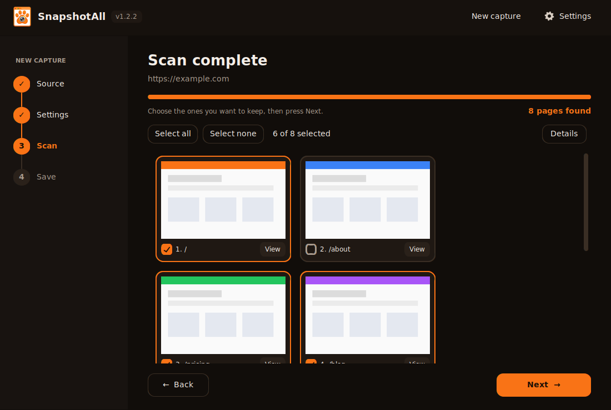
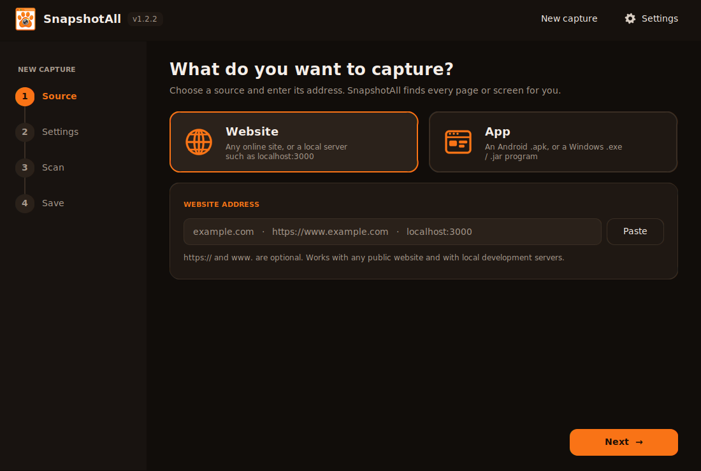
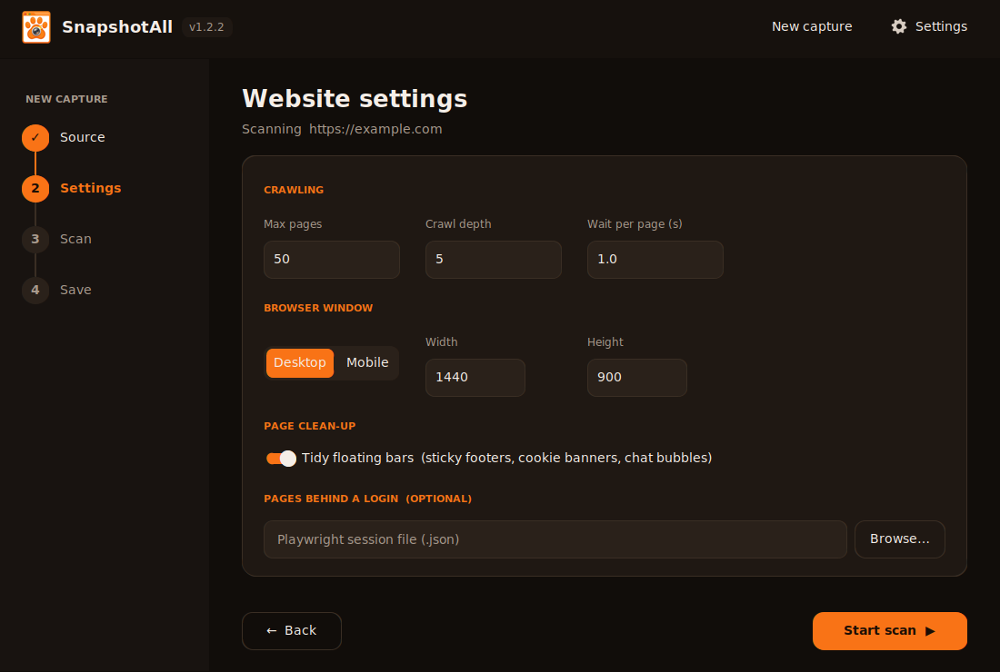
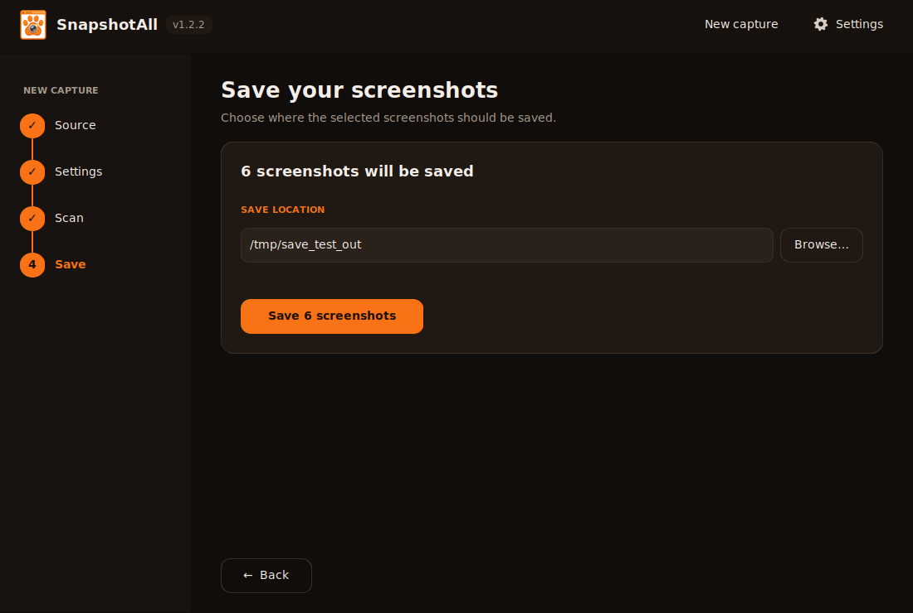
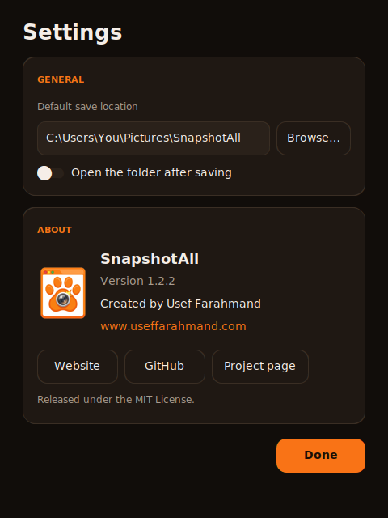

<div align="center">


# SnapshotAll

**Find every page of a website or every screen of an app, preview them all, and save the ones you want.**

[](https://github.com/Usef-Farahmand/SnapshotAll/actions/workflows/build.yml)
[](https://github.com/Usef-Farahmand/SnapshotAll/releases/latest)
[](https://github.com/Usef-Farahmand/SnapshotAll/releases)
[](LICENSE)


[Download](https://github.com/Usef-Farahmand/SnapshotAll/releases/latest) ·
[Report a bug](https://github.com/Usef-Farahmand/SnapshotAll/issues/new?template=bug_report.yml) ·
[Request a feature](https://github.com/Usef-Farahmand/SnapshotAll/issues/new?template=feature_request.yml)



<sub>Screenshots in this README use demo data.</sub>

</div>

---

## Table of contents

- [Why SnapshotAll?](#why-snapshotall)
- [How it works: four simple steps](#how-it-works-four-simple-steps)
- [Supported sources](#supported-sources)
- [Download and install (Windows)](#download-and-install-windows)
- [Command-line usage](#command-line-usage)
- [Code signing](#code-signing)
- [Run from source](#run-from-source)
- [Build the installer yourself](#build-the-installer-yourself)
- [Project structure](#project-structure)
- [Limitations](#limitations)
- [Troubleshooting](#troubleshooting)
- [Contributing](#contributing) · [Security](#security) · [Responsible use](#responsible-use) · [License](#license)

## Why SnapshotAll?

Designers, QA engineers, developers and writers often need a visual record of *every* page or screen of a product — for design reviews, regression checks, hand-offs or archiving. Doing that by hand is slow. SnapshotAll scans the source for you, shows a live preview of everything it finds, lets you pick what to keep, and saves it where you want.

## How it works: four simple steps

| | Step | What happens |
|---|---|---|
| 1 | **Source** | Choose **Website** or **App** and enter its address (a URL, or an `.apk` / `.exe` / `.jar` file). |
| 2 | **Settings** | Tune the options for that source: depth, limits, mobile mode, login session, and more. |
| 3 | **Scan** | A progress bar runs while SnapshotAll explores the whole source. Every page or screen it finds appears right away as a **preview card** you can select or deselect. |
| 4 | **Save** | Pick the save location. Only the screenshots you selected are saved. |

<table>
<tr>
<td></td>
<td></td>
</tr>
<tr>
<td></td>
<td></td>
</tr>
</table>

The app has a modern dark-and-orange interface with a toolbar (**New capture**, **Settings**). **Settings** holds the default save location and an **About** section with the app version, the developer's name and website.

<div align="center"></div>
 Screenshots are kept in a temporary folder during the scan and removed when you finish — nothing else is written to disk, and no log files are created.

## Supported sources

### Website
- Any online site or local development server (`example.com`, `https://www.example.com`, `localhost:3000`) — `https://` and `www.` are optional; redirects are followed automatically.
- Crawls same-site links, reads `sitemap.xml`, follows SPA hash routes (`#/about`).
- Auto-scrolls so lazy-loaded content appears; captures full-page images.
- Tidies floating elements so they don't land in the middle of a long screenshot: sticky and fixed footers go to the end of the page, cookie banners / chat bubbles / "back to top" buttons are hidden, fixed headers stay at the top (can be turned off).
- Desktop or **mobile** (iPhone 13) viewport.
- Pages **behind a login** via a Playwright session file.
- Uses **Microsoft Edge / Google Chrome** if installed (no download); otherwise downloads Chromium once.

### App
- **Android `.apk`** — installs the app on an emulator or USB phone, taps through the UI and captures every unique screen (with optional scrolling).
- **Windows `.exe` / `.jar`** — launches the program (or attaches to a running window by title) and uses Windows UI Automation to click buttons, tabs, menu items and links, capturing every new window state and dialog.
- Risky buttons (`delete`, `logout`, `pay`, `exit`, `save`, …) are skipped by default — configurable in Settings.

## Download and install (Windows)

1. Open the [**Releases**](https://github.com/Usef-Farahmand/SnapshotAll/releases/latest) page.
2. Download one of:
   - `SnapshotAll_Setup.exe` — installer (Start menu + desktop shortcut)
   - `SnapshotAll_Portable.zip` — no installation; unzip and run `SnapshotAll.exe`
3. Run it.

> **Windows SmartScreen warning?** The app is not code-signed yet. Click **More info → Run anyway**. Every release ships with `SHA256SUMS.txt` so you can verify your download — see [CODE_SIGNING.md](CODE_SIGNING.md) for details and how the warning will be removed.
> You can always review the source code and build the app yourself (see below).

## Command-line usage

The desktop app is built on the same engines as this CLI, which saves screenshots straight into a folder:

```bash
python snapshot_all.py <target> [options]
```

The mode is detected from the target: URL → website, `.apk` → Android, `.exe` / `.jar` → Windows app. Override it with `--mode {web,apk,desktop}`.

```bash
python snapshot_all.py https://example.com
python snapshot_all.py http://localhost:3000 --max-pages 100 --mobile
python snapshot_all.py app.apk --max-screens 60 --max-depth 4
python snapshot_all.py "C:\Program Files\MyApp\MyApp.exe"
python snapshot_all.py --attach "Untitled - Notepad"
```

| Option | Applies to | Default | Description |
|---|---|---|---|
| `--mode` | all | `auto` | Force `web`, `apk` or `desktop` |
| `-o, --out` | all | auto | Output folder |
| `--max-depth` | all | web 5, apk 3, desktop 2 | How deep to crawl |
| `--delay` | all | `1.0` | Seconds to wait after each load / tap |
| `--max-pages` | web | `50` | Maximum pages to capture |
| `--width`, `--height` | web | `1440`, `900` | Viewport size |
| `--mobile` | web | off | Emulate a phone (iPhone 13) |
| `--keep-floating` | web | off | Don't move or hide fixed / sticky bars (footers, cookie banners, chat bubbles) |
| `--storage-state` | web | – | Playwright session file for logged-in pages |
| `--max-screens` | apps | `40` | Maximum screens / window states |
| `--max-clicks` | apps | `25` | Max tappable elements tried per screen |
| `--avoid` | apps | see source | Regex of button labels that must never be tapped |
| `--scroll` | apk | `3` | Scroll steps captured per screen (`0` = off) |
| `--serial`, `--package` | apk | auto | `adb` device serial / app package name |
| `--attach` | desktop | – | Attach to a running window whose title matches this regex |

### Pages behind a login (website)

```bash
playwright codegen --save-storage=auth.json https://your-site.example/login
# log in in the window that opens, then close it
```

Then choose `auth.json` as the **session file** in step 2, or pass `--storage-state auth.json` on the command line.

## Code signing

Windows builds are not signed yet, so SmartScreen may warn on first launch. [CODE_SIGNING.md](CODE_SIGNING.md) explains why, how to verify a download, and the options for removing the warning (a low-cost open-source certificate, or Microsoft Store distribution).

## Run from source

Requirements: **Python 3.10+**.

```bash
git clone https://github.com/Usef-Farahmand/SnapshotAll.git
cd SnapshotAll
pip install -r requirements.txt
python snapshot_gui.py
```

On Windows you can also double-click `run_gui.bat` — it creates a virtual environment and installs everything on first run.

### APK requirements

- `adb` (Android Platform-Tools) in your `PATH` — or the copy bundled with `adbutils`, which SnapshotAll uses automatically.
- An Android emulator (e.g. Android Studio AVD) or a phone with **USB debugging** enabled, visible in `adb devices`.

## Build the installer yourself

**GitHub Actions (recommended).** Push to `main` (or run *Build Windows EXE and Release* manually). The workflow builds the app with PyInstaller, creates the installer with Inno Setup and publishes both to a GitHub Release.

**Locally on Windows.** Double-click `build_exe.bat` → `dist\SnapshotAll\SnapshotAll.exe`. To also create the installer, install [Inno Setup](https://jrsoftware.org/isinfo.php) and compile `installer.iss`.

## Project structure

```
SnapshotAll/
├── snapshot_gui.py        # desktop app: wizard UI (customtkinter)
├── snapshot_all.py        # CLI + website and Android engines
├── snapshot_desktop.py    # Windows app engine (UI Automation)
├── snapshot_common.py     # shared helpers, app name / version / author / website
├── assets/                # logo and icons
├── docs/                  # README images
├── installer.iss          # Inno Setup installer script
├── run_gui.bat            # run the GUI from source on Windows
├── build_exe.bat          # build the exe locally on Windows
├── requirements.txt
├── CODE_SIGNING.md        # code-signing policy and SmartScreen guide
└── .github/               # CI, release workflow, issue & PR templates
```

## Limitations

- **Websites:** pages reachable only through button clicks or form submissions are not discovered; CAPTCHAs and bot protection may block the crawler.
- **Android:** screens that need login or specific input can't be passed automatically — log in manually first, then run with the app's package name. Flutter apps, games and WebViews expose limited UI structure.
- **Windows apps:** relies on UI Automation, so custom-drawn interfaces (games, some Qt/Electron/canvas UIs) expose few controls. Launchers that start a second process may need **attach** mode instead. Windows only.
- No code signing yet, so Windows SmartScreen may warn on first launch.

## Troubleshooting

| Problem | Fix |
|---|---|
| "No usable browser found" | SnapshotAll downloads Chromium automatically (internet required). Or install Microsoft Edge / Google Chrome. |
| `adb not found` / no device | Start an emulator or connect a phone with USB debugging; check `adb devices`. |
| Windows app: nothing captured | Use **Attach**: start the app yourself, then enter part of its window title. |
| "Windows protected your PC" | Click **More info → Run anyway**. See [CODE_SIGNING.md](CODE_SIGNING.md). |
| Ctrl+V doesn't paste | Right-click the field → Paste, or use the **Paste** button. |
| The scan hit a problem | On the Scan page click **Details**, then **Copy details**, and include it in your bug report. |

## Contributing

Contributions are very welcome! Please read [CONTRIBUTING.md](CONTRIBUTING.md) and follow the [Code of Conduct](CODE_OF_CONDUCT.md). Good first steps: try the app and [open an issue](https://github.com/Usef-Farahmand/SnapshotAll/issues/new/choose).

## Security

Found a vulnerability? Please do **not** open a public issue — see [SECURITY.md](SECURITY.md).

## Responsible use

Only capture websites and apps that you own or have explicit permission to test. Respect terms of service, `robots.txt` policies and applicable laws. Screenshots can contain sensitive data — store and share them carefully. The authors are not responsible for misuse.

## License

Released under the [MIT License](LICENSE) © 2026 [Usef Farahmand](https://github.com/Usef-Farahmand) · [useffarahmand.com](https://www.useffarahmand.com/).

## Acknowledgments

[Playwright for Python](https://playwright.dev/python/) · [uiautomator2](https://github.com/openatx/uiautomator2) · [pywinauto](https://pywinauto.readthedocs.io/) · [CustomTkinter](https://github.com/TomSchimansky/CustomTkinter) · [Pillow](https://python-pillow.org/) · [PyInstaller](https://pyinstaller.org/) · [Inno Setup](https://jrsoftware.org/isinfo.php)
