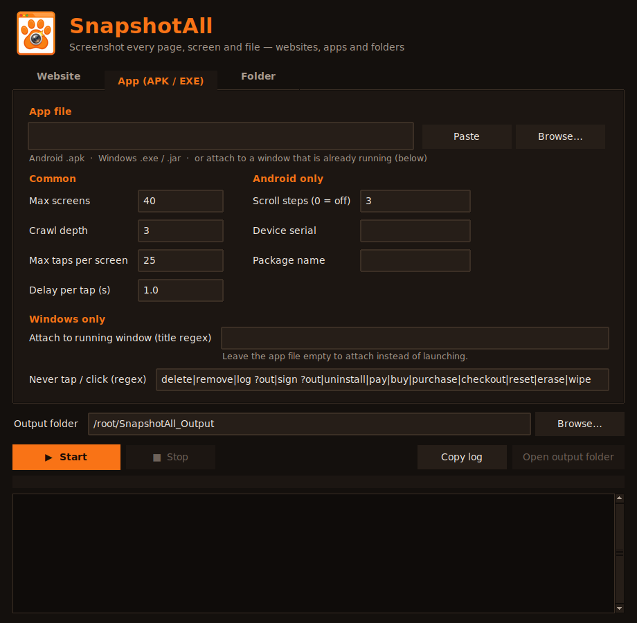
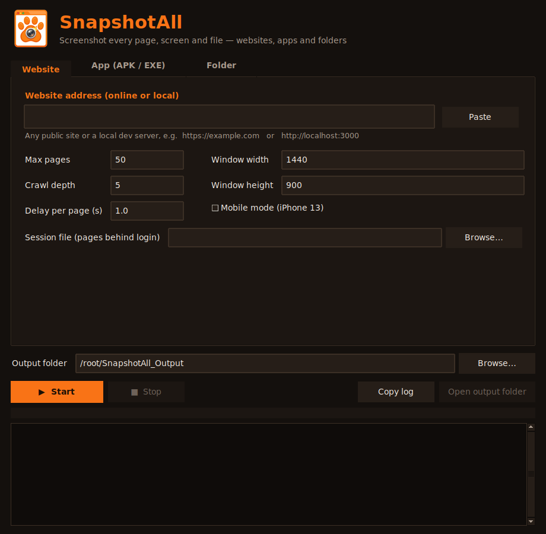
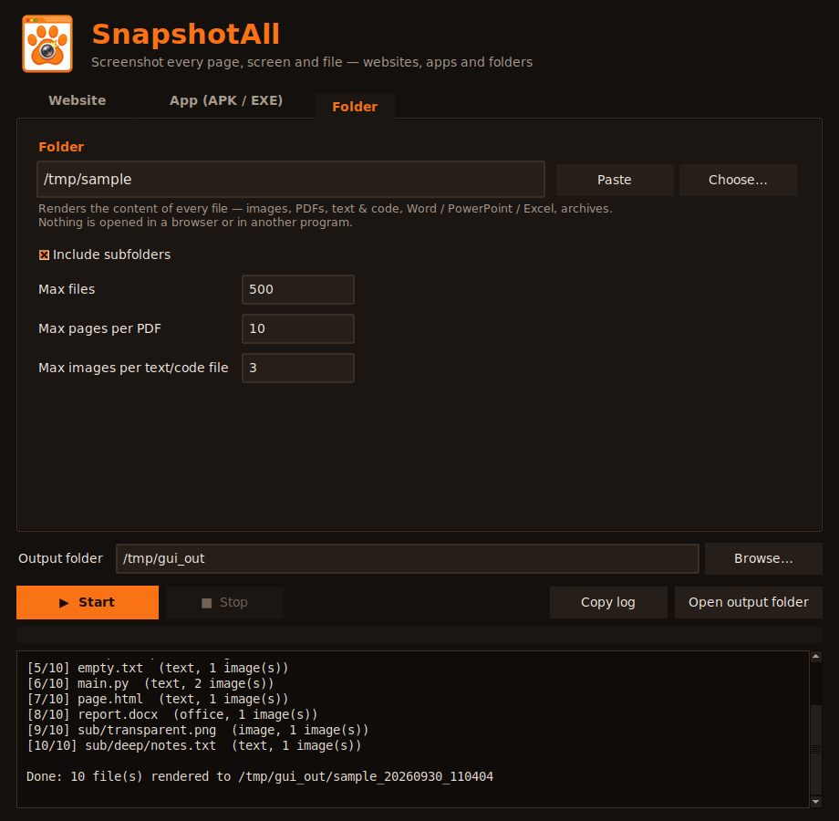
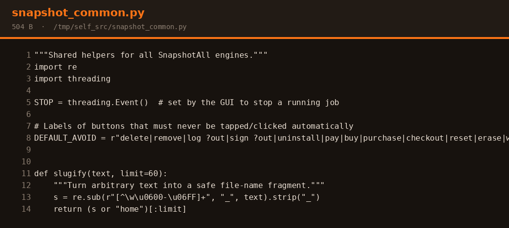

<div align="center">


# SnapshotAll

**Screenshot every page of a website, every screen of an app, and every file in a folder — in one click.**

[](https://github.com/Usef-Farahmand/SnapshotAll/actions/workflows/build.yml)
[](https://github.com/Usef-Farahmand/SnapshotAll/releases/latest)
[](https://github.com/Usef-Farahmand/SnapshotAll/releases)
[](LICENSE)


[Download](https://github.com/Usef-Farahmand/SnapshotAll/releases/latest) ·
[Report a bug](https://github.com/Usef-Farahmand/SnapshotAll/issues/new?template=bug_report.yml) ·
[Request a feature](https://github.com/Usef-Farahmand/SnapshotAll/issues/new?template=feature_request.yml)



</div>

---

## Table of contents

- [Why SnapshotAll?](#why-snapshotall)
- [Three tabs, three kinds of targets](#three-tabs-three-kinds-of-targets)
- [Download and install (Windows)](#download-and-install-windows)
- [Quick start](#quick-start)
- [Command-line usage](#command-line-usage)
- [How it works](#how-it-works)
- [Output](#output)
- [Run from source](#run-from-source)
- [Build the installer yourself](#build-the-installer-yourself)
- [Project structure](#project-structure)
- [Limitations](#limitations)
- [Troubleshooting](#troubleshooting)
- [Contributing](#contributing) · [Security](#security) · [Responsible use](#responsible-use) · [License](#license)

## Why SnapshotAll?

Designers, QA engineers, developers and documentation writers often need a visual record of *everything* in a product or project: every page, every screen, every file. Doing that by hand is slow. SnapshotAll automates it — give it a URL, an app or a folder and it walks through the target and saves the screenshots for you.

## Three tabs, three kinds of targets

| Tab | Target | What you get |
|---|---|---|
| **Website** | Any online site or local dev server (`https://example.com`, `http://localhost:3000`) | Full-page screenshots of every page it can reach |
| **App (APK / EXE)** | Android `.apk`, Windows `.exe` / `.jar`, or a window that is already running | A screenshot of every unique screen / window state |
| **Folder** | Any folder | A rendered image of the **content of every file** — no browser involved |

<table>
<tr>
<td></td>
<td></td>
</tr>
</table>

### Website

- Crawls same-site links, reads `sitemap.xml`, and follows SPA hash routes (`#/about`).
- Works with `http://localhost:...` dev servers.
- Auto-scrolls so lazy-loaded content appears; captures full-page PNGs.
- Desktop or **mobile** (iPhone 13) viewport.
- Pages **behind a login** via a Playwright session file.
- Uses **Microsoft Edge / Google Chrome** if installed (no download); otherwise downloads Chromium once.

### App (APK / EXE)

- **Android APK** — installs the app on an emulator or USB phone, taps through the UI and captures every unique screen (with optional scrolling).
- **Windows apps** — launches an `.exe` / `.jar` (or attaches to a running window by title) and uses Windows UI Automation to click buttons, tabs, menu items and links, capturing every new window state and dialog.
- Risky buttons (`delete`, `logout`, `pay`, `exit`, `save`, …) are skipped by default — fully configurable.

### Folder

Renders the content of each file directly (nothing is opened in a browser or another program):

| File type | Rendered as |
|---|---|
| Images (`png`, `jpg`, `gif`, `webp`, `bmp`, `ico`, `tiff`) | The image, re-saved as PNG |
| PDF | Each page (up to a limit) |
| Text & code (`txt`, `md`, `json`, `csv`, `py`, `js`, `html`, `css`, `xml`, `yml`, `sql`, …) | A dark code card with line numbers (HTML is shown as source) |
| Word / PowerPoint / Excel (`docx`, `pptx`, `xlsx`) | Extracted text on a card |
| Archives (`zip`, `jar`, `apk`, `whl`) | A file listing |
| Anything else | An info card (name, size, type, modified date) |

Subfolders are included by default, and the folder structure is mirrored in the output. Hidden files and folders such as `.git` and `node_modules` are skipped.

<div align="center"><br><sub>Folder mode rendering one of SnapshotAll's own source files.</sub></div>

## Download and install (Windows)

1. Open the [**Releases**](https://github.com/Usef-Farahmand/SnapshotAll/releases/latest) page.
2. Download one of:
   - `SnapshotAll_Setup.exe` — installer (Start menu + desktop shortcut)
   - `SnapshotAll_Portable.zip` — no installation; unzip and run `SnapshotAll.exe`
3. Run it.

> **Windows SmartScreen warning?** The app is not code-signed yet. Click **More info → Run anyway**.
> You can always review the source code and build the app yourself (see below).

## Quick start

1. Start SnapshotAll and pick a tab: **Website**, **App (APK / EXE)** or **Folder**.
2. Enter a URL, choose an app file, or choose a folder.
3. Choose an output folder.
4. Click **Start**. When it finishes, click **Open output folder**.

## Command-line usage

```bash
python snapshot_all.py <target> [options]
```

The mode is detected from the target: URL → website, `.apk` → Android, `.exe`/`.jar` → Windows app, existing folder or file → folder mode. Override it with `--mode {web,apk,desktop,folder}`.

```bash
python snapshot_all.py https://example.com
python snapshot_all.py http://localhost:3000 --max-pages 100 --mobile
python snapshot_all.py app.apk --max-screens 60 --max-depth 4
python snapshot_all.py "C:\Program Files\MyApp\MyApp.exe"
python snapshot_all.py --attach "Untitled - Notepad"
python snapshot_all.py ./my-project --pdf-pages 5
```

| Option | Applies to | Default | Description |
|---|---|---|---|
| `--mode` | all | `auto` | Force `web`, `apk`, `desktop` or `folder` |
| `-o, --out` | all | auto | Output folder |
| `--max-depth` | web / apps | web 5, apk 3, desktop 2 | How deep to crawl |
| `--delay` | web / apps | `1.0` | Seconds to wait after each load / tap |
| `--max-pages` | web | `50` | Maximum pages to capture |
| `--width`, `--height` | web | `1440`, `900` | Viewport size |
| `--mobile` | web | off | Emulate a phone (iPhone 13) |
| `--storage-state` | web | – | Playwright session file for logged-in pages |
| `--max-screens` | apps | `40` | Maximum screens / window states |
| `--max-clicks` | apps | `25` | Max tappable elements tried per screen |
| `--avoid` | apps | see source | Regex of button labels that must never be tapped |
| `--scroll` | apk | `3` | Scroll steps captured per screen (`0` = off) |
| `--serial`, `--package` | apk | auto | `adb` device serial / app package name |
| `--attach` | desktop | – | Attach to a running window whose title matches this regex |
| `--no-recursive` | folder | off | Skip subfolders |
| `--max-files` | folder | `500` | Maximum files to render |
| `--pdf-pages` | folder | `10` | Max pages rendered per PDF |
| `--text-pages` | folder | `3` | Max images per text / code file |

### Pages behind a login (website)

```bash
playwright codegen --save-storage=auth.json https://your-site.example/login
# log in in the window that opens, then close it
python snapshot_all.py https://your-site.example --storage-state auth.json
```

## How it works

**Websites** — a headless browser ([Playwright](https://playwright.dev/python/)) visits the start page, scrolls it, captures a full-page PNG, collects same-origin links and repeats breadth-first until the page or depth limit is reached.

**Android apps** — the APK is installed with `adb` and launched with [uiautomator2](https://github.com/openatx/uiautomator2). Each screen is fingerprinted from its UI hierarchy, and the explorer taps clickable elements breadth-first (restarting the app and replaying the tap path for each branch).

**Windows apps** — the app is launched (or attached to) and explored with Microsoft UI Automation through [pywinauto](https://pywinauto.readthedocs.io/). Windows, dialogs and popups are fingerprinted from their control tree; each new state is captured. Attached apps can't be restarted, so only one level of clicks is explored.

**Folders** — files are read directly and rendered with [Pillow](https://python-pillow.org/) and [PyMuPDF](https://pymupdf.readthedocs.io/); no browser or external viewer is started.

## Output

```
SnapshotAll_Output/
└── my-project_20260930_101500/
    ├── logo.png.png
    ├── README.md.png
    ├── report.pdf_p01.png
    ├── report.pdf_p02.png
    ├── src/
    │   └── main.py.png
    ├── index.tsv        # screenshot → source (URL, tap path or file) [→ kind]
    └── log.txt          # full run log
```

## Run from source

Requirements: **Python 3.10+**.

```bash
git clone https://github.com/Usef-Farahmand/SnapshotAll.git
cd SnapshotAll
pip install -r requirements.txt
python snapshot_gui.py
```

On Windows you can also double-click `run_gui.bat` — it creates a virtual environment and installs everything on first run.

### APK requirements

- `adb` (Android Platform-Tools) in your `PATH` — or the copy bundled with `adbutils`, which SnapshotAll uses automatically.
- An Android emulator (e.g. Android Studio AVD) or a phone with **USB debugging** enabled, visible in `adb devices`.

## Build the installer yourself

**GitHub Actions (recommended).** Push to `main` (or run *Build Windows EXE and Release* manually). The workflow builds the app with PyInstaller, creates the installer with Inno Setup and publishes both to a GitHub Release.

**Locally on Windows.** Double-click `build_exe.bat` → `dist\SnapshotAll\SnapshotAll.exe`. To also create the installer, install [Inno Setup](https://jrsoftware.org/isinfo.php) and compile `installer.iss`.

## Project structure

```
SnapshotAll/
├── snapshot_gui.py        # desktop app (dark & orange Tkinter GUI)
├── snapshot_all.py        # CLI + website and Android engines
├── snapshot_desktop.py    # Windows app engine (UI Automation)
├── snapshot_folder.py     # folder engine (renders file contents)
├── snapshot_common.py     # shared helpers
├── assets/                # logo and icons
├── docs/                  # README images
├── installer.iss          # Inno Setup installer script
├── run_gui.bat            # run the GUI from source on Windows
├── build_exe.bat          # build the exe locally on Windows
├── requirements.txt
└── .github/               # CI, release workflow, issue & PR templates
```

## Limitations

- **Websites:** pages reachable only through button clicks or form submissions are not discovered; CAPTCHAs and bot protection may block the crawler.
- **Android:** screens that need login or specific input can't be passed automatically — log in manually first, then run with the app's package name. Flutter apps, games and WebViews expose limited UI structure.
- **Windows apps:** relies on UI Automation, so custom-drawn interfaces (games, some Qt/Electron/canvas UIs) expose few controls. Launchers that start a second process may need **attach** mode instead. Only Windows is supported.
- **Folders:** Word/PowerPoint/Excel files are shown as extracted text, not as pixel-perfect pages. Text rendering uses a monospace font and does not shape right-to-left scripts.
- No code signing yet, so Windows SmartScreen may warn on first launch.

## Troubleshooting

| Problem | Fix |
|---|---|
| "No usable browser found" | SnapshotAll downloads Chromium automatically (internet required). Or install Microsoft Edge / Google Chrome. |
| `adb not found` / no device | Start an emulator or connect a phone with USB debugging; check `adb devices`. |
| Windows app: "No window" / nothing captured | Use **Attach**: start the app yourself, then enter part of its window title. |
| Ctrl+V doesn't paste | Use right-click → Paste, or the **Paste** button. |
| Need to share an error | Click **Copy log**, or attach `log.txt` from your output folder to an issue. |

## Contributing

Contributions are very welcome! Please read [CONTRIBUTING.md](CONTRIBUTING.md) and follow the [Code of Conduct](CODE_OF_CONDUCT.md). Good first steps: try the app and [open an issue](https://github.com/Usef-Farahmand/SnapshotAll/issues/new/choose).

## Security

Found a vulnerability? Please do **not** open a public issue — see [SECURITY.md](SECURITY.md).

## Responsible use

Only capture websites, apps and files that you own or have explicit permission to test. Respect terms of service, `robots.txt` policies and applicable laws. Screenshots can contain sensitive data — store and share them carefully. The authors are not responsible for misuse.

## License

Released under the [MIT License](LICENSE) © 2026 [Usef Farahmand](https://github.com/Usef-Farahmand).

## Acknowledgments

[Playwright for Python](https://playwright.dev/python/) · [uiautomator2](https://github.com/openatx/uiautomator2) · [pywinauto](https://pywinauto.readthedocs.io/) · [Pillow](https://python-pillow.org/) · [PyMuPDF](https://pymupdf.readthedocs.io/) · [PyInstaller](https://pyinstaller.org/) · [Inno Setup](https://jrsoftware.org/isinfo.php)
